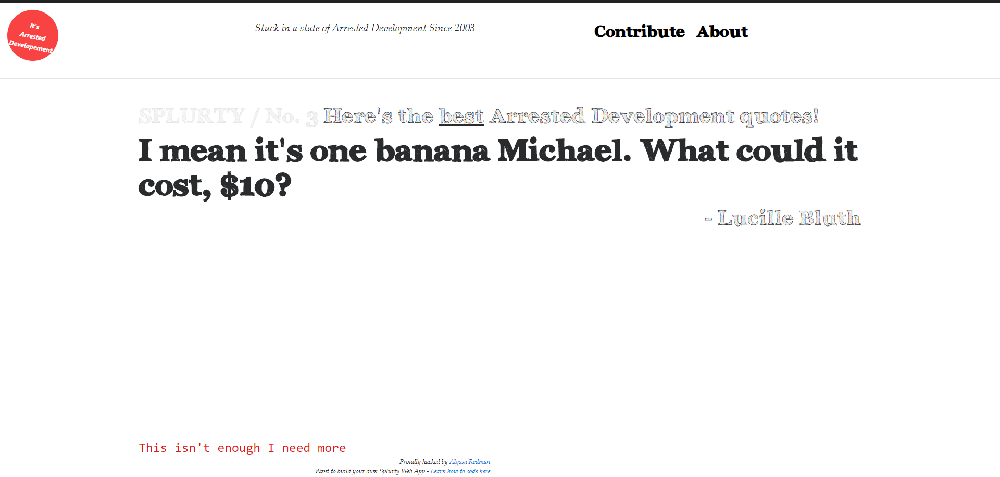
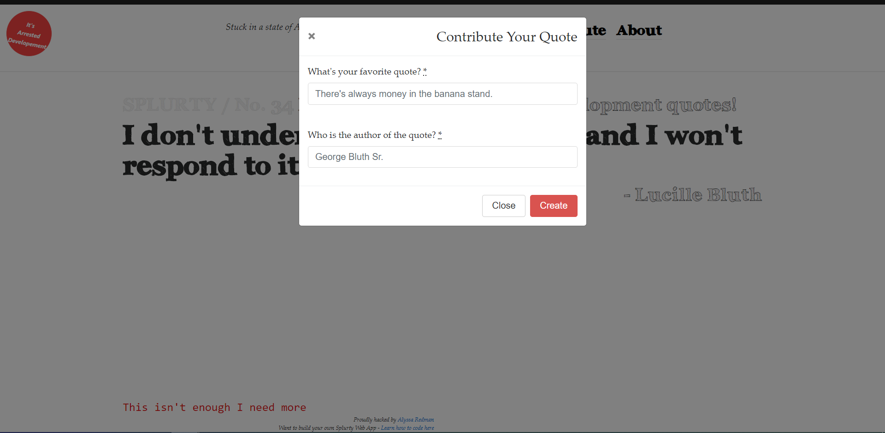

# Splurty

A database-powered quote generator, with a mobile first design, using Ruby on Rails framework, HTML, and CSS.

[View the deployed application](http://splurty-alyssa-redman.herokuapp.com/)

_____________

### Features 

* Ruby 2.5.3 

* jQuery

* Bootstrap

* PostgresSQL database

* Simple Form gem allows new quote submission

* Quotes load randomly each time the page refreshes

______________

### How to use

Users can refresh the page, or click "This isn't enough I need more", to load a different quote from the database. New quotes can be added via a pop-up modal by clicking "Contribute". 

______________

### Screenshots

